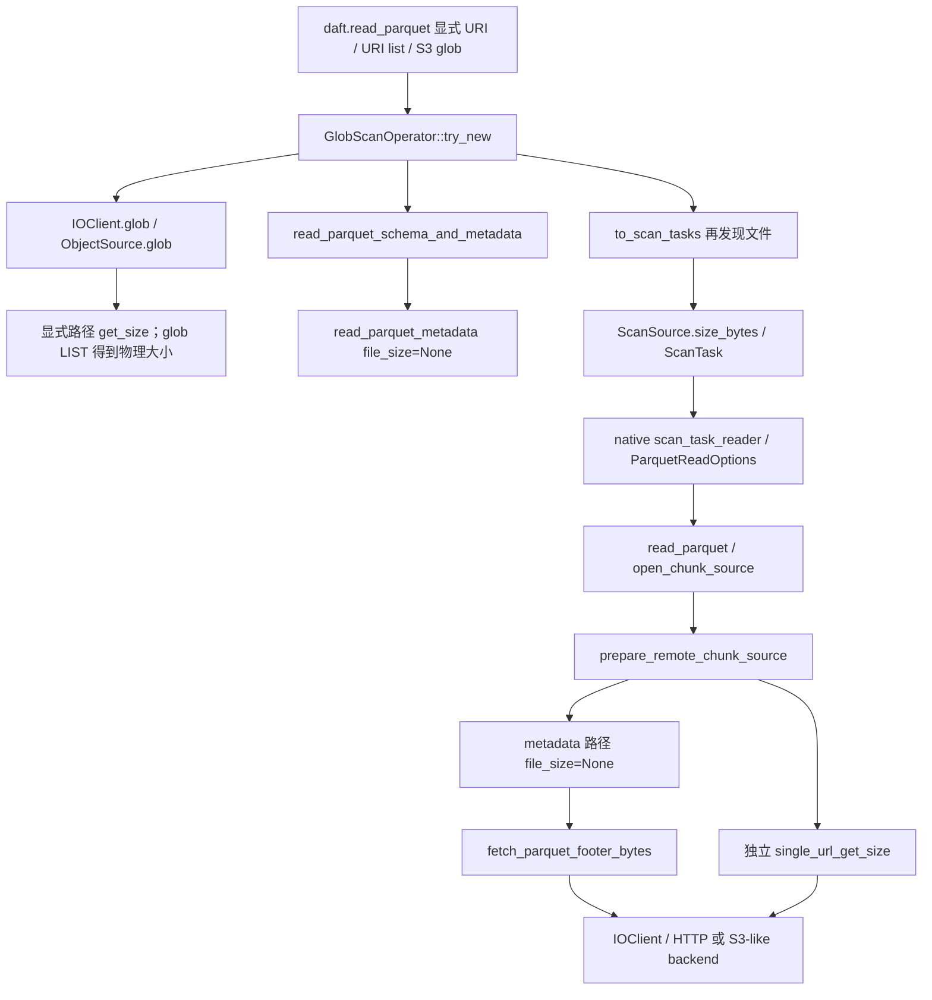

# Daft #1881 调查与运行验证

## 1. 结论与推进建议

**已确认，但边界是 native runner 的 HTTP 与本地 SeaweedFS S3-compatible 读取。** 在本轮获取的 upstream main 上，H1、H2 都成立；H2 的两个大小查询只发生在显式 `disable_suffix_range=True` 时。默认 suffix range 路径仍有一个 reader 大小查询，以及 schema inference 与执行之间的重复 footer GET，不能声称默认路径也有两个 reader HEAD。

建议继续一个**仅针对 H2 的小范围贡献**，作为 **TRUST ONLY / technical ceiling B**。先让维护者确认是否接受针对禁用 suffix range 配置的优化，再实现。H1 不宜直接把现有 `ScanSource.size_bytes` 传给 reader：这个字段在扫描拆分后会变成 row groups 的压缩字节之和。全生命周期物理大小传递和 footer metadata 复用应分别评估，不合并到第一份 PR。

这是 Agent 实测的机制证据，尚无修复后的请求数或端到端性能收益，用户尚未人工复核。没有创建/评论 issue、认领、assign、PR、push。本轮没有实现修复或因果对照补丁；已有基线、eager reader 对照和日志插桩足以定位重复查询。

## 2. upstream、工作区与真实构建

- upstream：`https://github.com/Eventual-Inc/Daft.git`。
- 初始 `/workspace/Daft` 的 origin 是 `easyrev/Daft`，HEAD 是 `141bb8214327b3075641977cb070dad7410ce55b`；原目录 git status 为空。
- 独立 clone：`/workspace/daft-issue-1881`。本地 clone 使用 `--no-hardlinks`，然后改新 clone 的 origin、从真正 upstream fetch main；没有改原目录 remote 或工作文件。
- 获取并检出完成：**2026-10-09 21:12:34（Asia/Shanghai；13:12:34 UTC）**。
- upstream 与全部实验 SHA：**`d3cd974150ba93dbbe8efef8370b129538fcee4b`**。
- 最后再次 `ls-remote`：2026-10-09 21:28:11（13:28:11 UTC），main 仍是上述 SHA。见 `raw/upstream-final.txt`。
- 阅读了唯一适用的 `AGENTS.md`、`CONTRIBUTING.md`、`docs/contributing/development.md` 的环境/构建/调试/测试要求，以及 Makefile、Cargo/pyproject 配置、rust-toolchain 和仓库 I/O 集成服务配置。原 checkout 与 upstream 的这些要求一致；pyproject 的变化仅是 Ray 依赖范围/开发版本，本轮未用 Ray。

| 项目 | 实际值 |
|---|---|
| Python | 3.11.16，`/workspace/daft-issue-1881/.venv/bin/python` |
| Rust | rustc 1.98.0-nightly，`d1fc603d1788cc3c0eebdb94a45a61c4f33b1674`；仓库指定 `nightly-2026-05-27` |
| PyArrow | 22.0.0，复用原环境依赖 |
| Daft | 0.3.0-dev0 |
| Runner | native |
| 构建 | dev / unoptimized，debug info=0，incremental=0，jobs=4；跳过 dashboard 前端构建 |
| Python 包 | `/workspace/daft-issue-1881/daft/__init__.py` |
| 原生扩展 | `/workspace/daft-issue-1881/daft/daft.abi3.so` |
| 本次 Cargo 产物 | `/workspace/daft-issue-1881/target/debug/libdaft.so` |

未修改基线扩展与本次 Cargo 产物 SHA-256 均为 `cc08a6cd45aa1d65ebb279188553c953870accc7af07744c28a5a8afea905800`。构建日志显示相关源码 crate 来自独立 clone，所有运行进程断言包/扩展位于该 clone，扩展哈希等于该 clone 的 Cargo 产物。版本字符串没有被当作构建来源证明。

基线时唯一未提交内容是 `?? analysis/`，产品源码无改动。随后仅增加三处日志插桩，独立保存为 `instrumentation.patch`；插桩产物的 SHA-256 为 `51da8b7ba0115eaf5aabf5db6e5878d5b26307cb130f8761d16605e841e56f63`，补丁全文和 dirty status 已写入 `raw/provenance-instrumented.json`。目前源码已反向应用补丁恢复，扩展及 libdaft.so 已恢复基线哈希；`raw/provenance-restored.json` 的 source_diff 为空。原目录最后的 git status 仍为空。

构建过程保留了完整日志：初次 `python -m maturin` 因新 venv 没有 maturin executable 失败；改用现有 ELF executable 后，`develop --uv` 自动解析并安装了新环境依赖。此流程被停止，新任务 venv 的自动安装被清除；最终使用 `develop --skip-install --locked` 和原环境已安装依赖。没有升级 Rust/toolchain，也没有靠依赖升级解决构建错误。最终基线构建成功，约 1m06s；插桩重建约 59s。详见 `raw/build*.log` 和 `BUILD_AND_RUN.md`。

## 3. 调用链与大小的语义

直接 eager 对照走 `MicroPartition.read_parquet(predicate=id >= 0)` → `read_parquet_into_loaded_micropartition` → 同一真实 remote reader。predicate 非空触发现有 eager 分支，96 行全部符合，读取并核对所有列；没有用 count/limit/explain 代替正常数据读取。

关键位置（均对应上述 SHA）：

- `src/daft-io/src/object_store_glob.rs:375`：显式非 glob 路径先 `get_size`，得到 `FileMetadata.size`；成功 HEAD 是发现请求，不是重试。
- `src/daft-io/src/s3_like.rs:1020`：LIST 中的 Size 转成 `FileMetadata.size`；`get_size` 走真实 SDK `head_object`。
- `src/daft-scan/src/glob.rs:189`：schema inference 仅拿 filepath，丢弃本次发现得到的大小；`src/daft-parquet/src/read.rs:452` 将 `None` 传给 metadata reader。
- `src/daft-scan/src/glob.rs:711`、`:768`：执行扫描生成 `ScanSource` 时保存发现的大小；原始未拆分任务中这是真实物理对象字节数。
- `src/daft-local-execution/src/sources/scan_task_reader.rs:148`：ParquetReadOptions 传 row groups、predicate、已有 parquet metadata 等，但没有物理文件大小选项。
- `src/daft-parquet/src/reader/chunk_source.rs:104`：无条件并行 `read_parquet_metadata(file_size=None)` 与独立 `single_url_get_size`。
- `src/daft-parquet/src/metadata.rs:431`：仅当大小未知且不支持 suffix range 时，footer 路径自行查大小。
- `src/daft-io/src/lib.rs:221`：实际代码仍是 `!self.config.disable_suffix_range`，不是 backend 的 Range 失败检测。实验使用真实 IOConfig 构造参数进入分支；两种服务均支持 suffix range。

**大小不能混用：** 3284/3300 是整个 Snappy Parquet 对象的物理长度，包括 footer。`TableMetadata.column_sizes` 是 Arrow materialized size 的估计，用于内存估算。`split_by_row_groups` 在 `src/daft-scan/src/scan_task_iters/mod.rs:286` 改写 `new_source.size_bytes` 为选中 row groups 的压缩字节之和，它不包含完整文件/footer；ScanTask 的聚合 `size_bytes_on_disk` 也不能无条件当作一个文件的长度。`GetResult` 的流长度/size hint 还可能是一个 range 的长度，不能据此推导对象全长。

**reader 保留 file_size 的原因和限制：** 查询结果进入 RemoteChunkSource 的 `file_len`，再进入每个 `OffsetBytes`，实现 arrow-rs `Length::len()` 的整文件长度契约（chunk_source.rs:193）。实际 `get_read/get_bytes` 边界检查用的是 `base` 和当前 chunk bytes 长度，不能把它描述成按物理 file_len 检查。进一步查看锁定的 parquet 59.0.0：当前 `SerializedPageReader::new` 从 column metadata 的 `byte_range()` 建立读取边界，没有发现这条正常 decode 路径调用 `OffsetBytes::len()`。本轮没有实测删除长度字段；这不足以证明整文件长度可以安全伪造或删掉。第一份 PR 应保留它的契约和错误，而不是顺便改 ChunkReader。

## 4. H1、H2 的证据与未覆盖项

### H1：发现/扫描掌握物理大小，reader 未复用——已确认

Known：S3 glob 的实际 LIST XML 中有 `part-0.parquet=3284`、`part-1.parquet=3300`；记录器把 key/physical_size 保存进原始请求日志。日志插桩在真正被执行的 native `ScanSource` 上再次看到 `Some(3284)` / `Some(3300)`、`chunk_spec=None`。默认配置执行阶段仍有两个 HEAD（每文件一个）；禁用 suffix 后四个 HEAD（每文件两个）。显式 URI 和 URI list 同样先通过发现 HEAD 获得物理大小，然后执行 reader 再查。

schema inference 还有独立丢失：构造阶段发现大小后，禁用 suffix 时推断再次 HEAD；默认 suffix 时推断只 GET footer，不 HEAD。提供 schema 的现有 `infer_schema=False` 路径没有 schema footer GET，但仍进行第一条路径的存在性检查，并在 collection 发现两文件、进入相同 reader。

Inferred：正确保存物理文件长度并传到真实 reader，理论上可让未拆分任务的 reader 完全不用额外 HEAD；这包括默认 suffix 路径。不过本轮没有实施/验证这种补丁，也没有把“理论上少 HEAD”写成实际性能收益。

Unknown：Ray/分布式执行、被拆分后的任务、Iceberg/Delta、manifest skip_glob、非 HTTP/S3 后端、对象被替换时的行为。当前真实 reader 没有物理 file_size 的 Python 入参，因此没有构造“reader 已获得已知大小”的 Python 端到端证据。

### H2：同一 reader 初始化重复查大小——仅禁用 suffix 时确认

Known：eager reader 对照没有 glob/schema discovery；默认 **1 HEAD + 4 GET**，禁用 suffix **2 HEAD + 4 GET**。三次全新进程完全一致，GET body 总字节都为 **5189**。四个 GET 是一次 footer 与三个 row-group data ranges。两个 HEAD 都返回 200，紧接一个正常 bounded footer GET，不是 redirect、retry 或失败探测。

native DataFrame 扫描相同：双文件 S3 glob 默认 reader **2 HEAD + 8 GET**；禁用 suffix reader **4 HEAD + 8 GET**。IOStats-only 插桩的上下文计数逐项与服务端请求计数核对。默认 metadata 使用 suffix GET，独立 HEAD 负责 file_len；禁用 suffix 后 metadata 自己 HEAD，并行分支仍另 HEAD。

Unknown：不同 backend 的 get_size 是否需要额外网络操作、真实 AWS S3 的时间/成本收益，以及不同延迟分布下共享 HEAD 的尾延迟。没有 AWS 性能、训练吞吐、release benchmark 结论。

### 重复 footer metadata I/O：有实测，也有范围限制

native schema-inferred 单文件构造时 GET footer，collection 再 GET 同一 footer；双文件 glob 的首文件也是如此。默认不会自动保存 schema inference 的完整 footer 供 reader 使用，仅保留 row count/column size 等 TableMetadata。另有静态证据：ParquetReadOptions.metadata 有 TODO，当前 reader 不消费它。拆分路径会携带部分 row-group metadata，却仍读 footer，这一具体执行路径未运行，不当作端到端确认。

在大 footer 输入中，schema 与 reader 都各取两次 footer。这不是“两次重复 GET 全都可删除”：每个独立 metadata 初始化的第二次取数是 footer 大于初始 128KiB 所需的扩展读取。

## 5. 请求计数与结果校验

输入本地生成；小文件各 96 行、3 row groups、3 列，包含字符串与数值 null。双文件共 192 行，id 不重复。大 footer 文件 353371 字节，footer 351462 字节，仍只有 96 行。PyArrow 用于生成和独立读回 oracle；被测读取全部由 Daft 完成，逐行逐列核对所有结果（按唯一 id 排序），包括 null。

未修改基线 14 场景 × 3 fresh processes = **42 次完整扫描、471 个实际请求**；所有相同场景三次的计数、body bytes、状态完全一致。额外日志插桩 8 场景 × 2 = **16 次完整扫描、172 个实际请求**，对应 28 个 API 边界计数行与基线一致，全部 IOStats 网络计数与服务端对齐。HTTP HEAD=200、Range GET=206、S3 LIST=200，无 redirect、retry、write error 或失败响应。

以下是代表性阶段表。完整输入/backend/配置/API 边界表及归属审计见 **`RESULTS.md`**、`raw/baseline-final/counts.csv`、`raw/instrumented/stages.csv`。S3 glob 每个 LIST 的 918 bytes 包含另外一个未匹配的大-footer对象的 entry；实际只读取 `part-*.parquet` 两文件。

| 输入 / backend | disable_suffix_range | 大小状态 | 阶段 | HEAD | LIST | GET | body bytes | 结果 |
|---|---|---|---|---:|---:|---:|---:|---|
| 单 URI / HTTP | 默认 false | 发现后已知 3284 | 构造时发现 | 1 | 0 | 0 | 0 | 96 行全量通过 |
| 单 URI / HTTP | false | inference 入参未知 | schema inference | 0 | 0 | 1 | 3284 | 同上 |
| 单 URI / HTTP | false | ScanSource 已知；reader 未知 | collection 时发现 | 1 | 0 | 0 | 0 | 同上 |
| 单 URI / HTTP | false | 同上 | reader execution | 1 | 0 | 4 | 5189 | 同上 |
| 单 URI / HTTP | true | inference 入参未知 | schema inference | 1 | 0 | 1 | 3284 | 96 行全量通过 |
| 单 URI / HTTP | true | ScanSource 已知；reader 未知 | reader execution | 2 | 0 | 4 | 5189 | 同上 |
| 双文件 glob / SeaweedFS S3-compatible | false | LIST 已知 3284/3300 | 构造时发现 | 0 | 1 | 0 | 918 | 192 行全量通过 |
| 同上 | false | inference 入参未知 | schema inference | 0 | 0 | 1 | 3284 | 同上 |
| 同上 | false | ScanSource 已知；reader 未知 | collection 时发现 | 0 | 1 | 0 | 918 | 同上 |
| 同上 | false | 同上 | reader execution | 2 | 0 | 8 | 10410 | 同上 |
| 同上 | true | inference 入参未知 | schema inference | 1 | 0 | 1 | 3284 | 同上 |
| 同上 | true | ScanSource 已知；reader 未知 | reader execution | 4 | 0 | 8 | 10410 | 同上 |
| eager MicroPartition / HTTP | false | reader 入参未知 | reader execution | 1 | 0 | 4 | 5189 | 96 行全量通过 |
| 同上 | true | 同上 | reader execution | 2 | 0 | 4 | 5189 | 同上 |

true 配置未列出的发现阶段计数与 false 一致，完整表未省略。服务器首先把请求归到可观测的 `construction` / `collection` / `reader` API 边界；独立 IOStats context 再拆分 discovery/schema/reader。所有归属已核对服务器总数，未凭同一 URI 上 HEAD 的到达顺序猜测。

bytes 是 HTTP 服务/记录代理成功写出的响应 body 字节；不含 headers/TCP/TLS，不等于 Daft 消费字节。SeaweedFS 前端的 loopback 代理每次原样转发一次请求，无自己的 retry/cache；HEAD 不发送 body，LIST 记录真实 XML 文件大小。上传、创建 bucket 等 setup 直接使用 9000，排除在被测计数之外。普通 HTTP 支持 HEAD、bounded/offset Range 与 suffix Range；实验实际使用 bounded/suffix，服务正确夹取小文件。S3 后端调用的是真实 Daft S3-like SDK 路径，经本地 SeaweedFS，HTTP 结果没有冒充 S3 验证。这个本地服务也没有冒充 AWS S3 性能。

大 footer 代表性网络形态：

- 默认未知大小：`bytes=-131072` → `bytes=-351462`，每次 metadata 初始化传 482534 bytes；第二个 GET 重新取完整 footer。
- 禁用 suffix：HEAD 后 `bytes=222299-353370` → `bytes=1909-222298`，每次 metadata 初始化只传 351462 bytes；第二个 GET 只取缺失前缀。
- reader 加三次数据 GET 后分别是 484439 / 353367 bytes。字节差来自现有 footer 策略，并非本轮补丁收益。

## 6. 定向查重与历史重叠

`#1881` 正文、全部 comments 和 timeline 已读取：open、零评论、无 assignee，timeline 仅有项目状态和标签事件，没有认领/cross-reference。作者是维护者 samster25；当前标签 help wanted / perf / p2 backlog。这是可调查信号，不保证新 PR 一定被接受。

搜索了编号、redundant/duplicate HEAD、file_size/get_size/file metadata reuse、read_parquet_metadata、prepare_remote_chunk_source、suffix range。发现 connector 的 `search_issues` 对 `is:pr` 未正确返回 PR，后续 PR 查重改用 REST `/search/issues`；报告依据 REST 结果。限定 title/body 的相关 open Parquet 查询共 32 条，size+parquet 共 79 条，均未截断；目标符号和语义查询结果保存在 `raw/final-search.json` 和 `raw/github-evidence.json`。

**查重覆盖限制：宽泛历史查重未完成。** 几个早期含 comments 的广泛 HEAD/metadata 查询超过 100 条，只检查了第一页；不把零结果解释为绝对没人做。编号/目标语义、相关 open PR、issue timeline、涉及路径近期修改的定向查重已完成，未发现同一 H2 范围的认领或实现。没有检查所有未公开 fork 工作。

| 工作 | 与本轮的关系 |
|---|---|
| [#4775](https://github.com/Eventual-Inc/Daft/pull/4775)，merged | 已实现 suffix-range metadata 优化，关闭 #4609。默认 metadata 不需要 HEAD 是既有成果；没有覆盖 reader 独立 file_len HEAD / 禁用 suffix 的重复 HEAD。 |
| [#5188](https://github.com/Eventual-Inc/Daft/pull/5188)，merged | 加入 disable_suffix_range，明确不同 S3-compatible 实现可能不支持 suffix；配置分支是正常支持路径。 |
| [#6952](https://github.com/Eventual-Inc/Daft/pull/6952)，merged | 当前 reader 重写。chunk_source.rs 在此后没有修改历史，仍保留 metadata/size 并行 join。 |
| [#2694](https://github.com/Eventual-Inc/Daft/pull/2694)，merged | 历史上只缓存拆分需要的部分 RG metadata，避免整个 footer 在 Ray 序列化放大；提醒 metadata 复用有任务索引/序列化边界，不应顺便恢复全量 cache。 |
| [#7289](https://github.com/Eventual-Inc/Daft/pull/7289)，open | 重写 RG ownership/admission/lifecycle，改同一文件。但实际 patch 在 prepare_remote_chunk_source 的 metadata/size join 处没有改变查询机制；不等于 H2 功能重叠。可能产生文本冲突/集成协调。 |
| [#7488](https://github.com/Eventual-Inc/Daft/pull/7488)，open | predicate pipeline，文件列表没有 chunk_source/metadata 的对应修改；未发现 H2 重叠。 |
| [#7481](https://github.com/Eventual-Inc/Daft/pull/7481)，merged | 优化 File `file_size()` 表达式打开文件的成本，属于其他入口，不修复 Parquet 初始化。 |
| #6542 / #7161；#7155 closed-unmerged | 内存/列大小估算和 split metadata，影响 size 的语义。不是消除本轮 reader HEAD。 |

其他当前 open PR 的主题是 count/delete/limit、projection、distributed、backend/SQL/HF 等；没有发现明确承诺 H2 消除的 PR。全部判断截至此次获取时间，不能替代实施前再次查重。

## 7. 最小修改范围与 trade-off

| 方向 | 收益边界 | 范围/风险 | 本轮建议 |
|---|---|---|---|
| 在一次 reader 初始化共享 size 查询 | 仅 `disable_suffix_range=True`，预期每 reader 少一个 HEAD | private prepare/footer 分支；保留默认 join；需要确认错误传播/取消语义 | 优先，一个小 PR |
| 复用扫描已知物理大小 | 默认/禁用 suffix 都可能省 reader HEAD；禁用 suffix 的 schema inference 也可能受益 | 需要独立、明确的 per-file physical size，经过 ScanSource/ScanTask/options；split 不能复用现有 size 字段 | 暂不并入第一份 PR |
| 复用预先读取的 footer metadata | 已有 metadata 的路径少重复 GET | schema/RG 原始索引、field mapping、局部 adapter、Ray 序列化/内存/对象变化，多个抽象层 | 本轮不推进 |

最小合理 H2 方案是：默认 suffix 保持当前 `metadata suffix GET || independent HEAD`；禁用 suffix 时只做一个 size 查询，再把真实大小供 footer bounded GET 与 ChunkSource 共用。可以保留 private fallback：任何真正未知大小的独立 metadata 调用仍走现有查询。不要无条件把两种配置都改成先 HEAD 再 footer。

这里的依赖并非简单“串行化必然慢”：禁用 suffix 的基线 metadata 本来就是 `HEAD → footer GET`，同时还有另一个 HEAD。复用一个 HEAD 并没有在这条 footer 链上新增 round trip；但更少请求不保证更低关键路径延迟。并行两次 HEAD 的快慢分布、错误/重试、连接池和吞吐会影响结果。本轮时间值只是运行记录，没有注入延迟或 A/B benchmark，不提供性能百分比。

边界必须保留：

1. **默认路径**：H2-only PR 不减少默认的一个 reader HEAD，保留 suffix GET/HEAD 的重叠。若维护者要求默认路径收益，第一份 PR 应重新定范围，而不是夸大 H2。
2. **已知大小可信度/对象替换**：LIST、HEAD、footer、data 目前也不是同一 ETag/version 的快照，物理大小查询不提供一致性保证。复用更早 LIST 会拉长陈旧窗口；不能借机许诺并发覆盖安全。H2 在同一初始化内共享一次结果，边界较小。
3. **大 footer**：保持补读缺失前缀的行为；相同 footer/数据 byte ranges 应作为回归条件。已有默认 suffix 的二次全-footer读取不在 H2 的 scope。
4. **小文件**：保留 size<12、footer_len>size 的现有错误检查、saturating/min 处理及错误类别。不能通过伪造 Length 来省 HEAD。
5. **未知大小回退**：未获大小、没有 ScanTask（例如 eager MicroPartition）的真实入口仍能读；不能要求用户提供大小或新增公共 API 方便测试。
6. **错误传播**：基线 join 等待两个结果，再先传播 metadata 错误、后传播独立大小错误。改为共享 HEAD 可能影响失败的封装、优先级和另一任务的取消。必须用现有 error conversion 保持兼容并补适量回归验证；本轮尚未验证异常输入/失败时的对照行为。
7. **维护者决定**：是否接受针对非默认配置的一份 reader-local 优化，以及是否将后续 physical size 传递单独处理。#7289 的同文件改动需实施前再次协调，但本轮未发现功能重叠。

最值得下一步确认的一件事：**维护者是否愿意接受只修复 `disable_suffix_range=True` 的重复 HEAD、保持默认并行流程的 reader-local PR？** 若接受，已有小文件/大 footer/两种配置/真实 HTTP 与 S3-compatible 脚本可转化为适量回归测试。若只期待广泛默认路径优化，这个 issue 暂不适合作为你的第一份适度规模贡献，应停止 H2 扩展，另选任务。

## 8. 复核材料

- `BUILD_AND_RUN.md`：实际环境复用、构建、服务、复现/插桩/恢复命令和已遇到的环境问题。
- `generate_inputs.py`：小输入和大 footer 的确定性生成；数据只存忽略的 generated/。
- `request_server.py`：正确 HTTP Range server + SeaweedFS 透明请求记录器。
- `run_case.py`、`run_matrix.py`：新进程真实读取、全部结果校验、分 API 边界请求记录。
- `capture_provenance.py`：源码 SHA/dirty state、导入路径、原生扩展与 Cargo 产物哈希核对。
- `analyze_results.py`、`RESULTS.md`：三次重复一致性、插桩对照和 IOStats/服务端对齐、完整结果表。
- `raw/baseline-final/`：权威未修改基线请求 JSONL、CSV、42 份结果和进程 log。
- `raw/instrumented/`：单独保存的16次日志插桩结果，不冒充未修改基线。
- `raw/provenance-*.json`、`raw/build*.log`、`raw/verification.json`：来源/构建/校验记录。
- `instrumentation.patch`：仅记录日志的补丁；没有行为修复，当前未应用。
- `COMMENT_DRAFT.md`：可供人工复核后粘贴的英文评论草稿，未发送。

raw 中 baseline/baseline-r1/baseline-v1 是开发复现脚本时的失败或部分运行，不能替代 baseline-final；相关原始错误仍保留。测试证据由 Agent 产生；没有声称用户已经人工检查。
